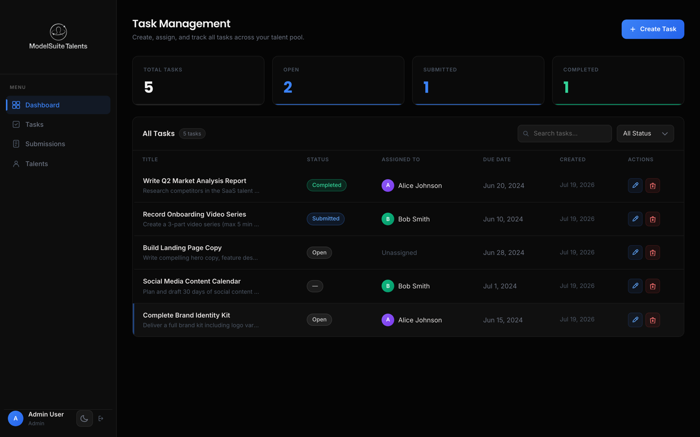
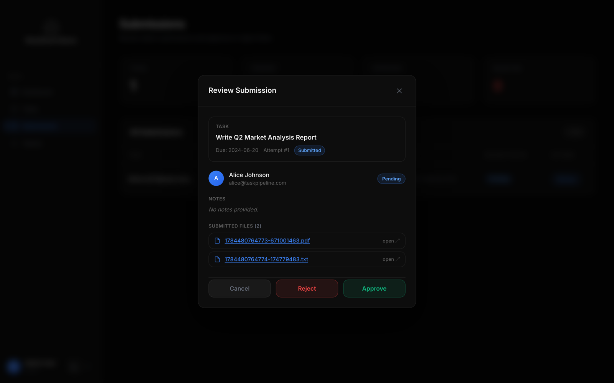
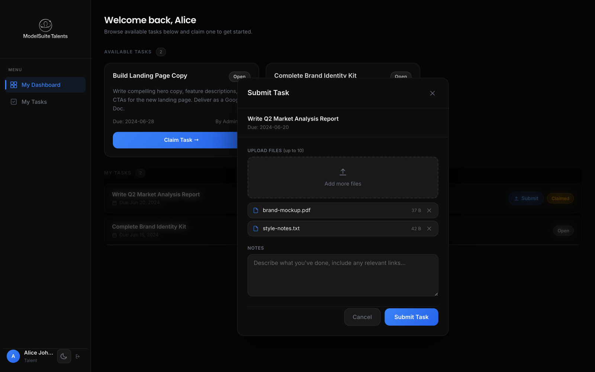
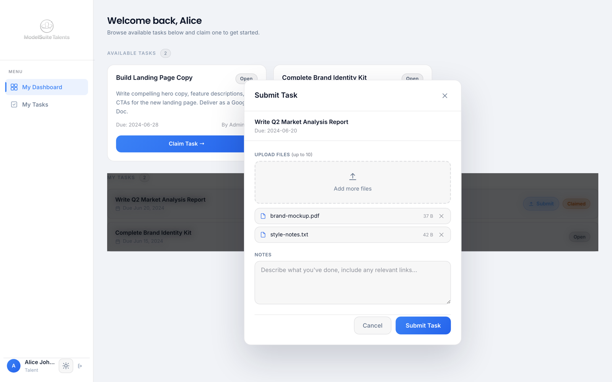
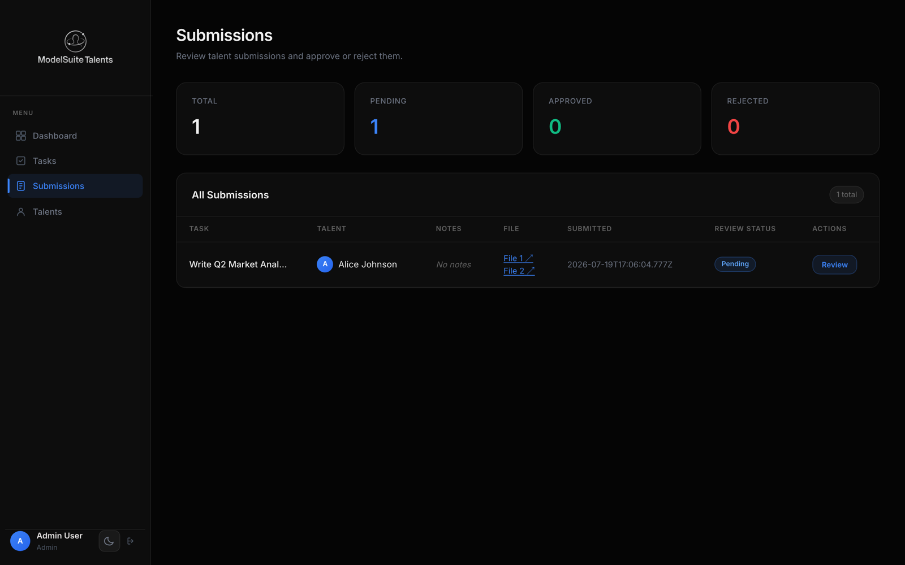
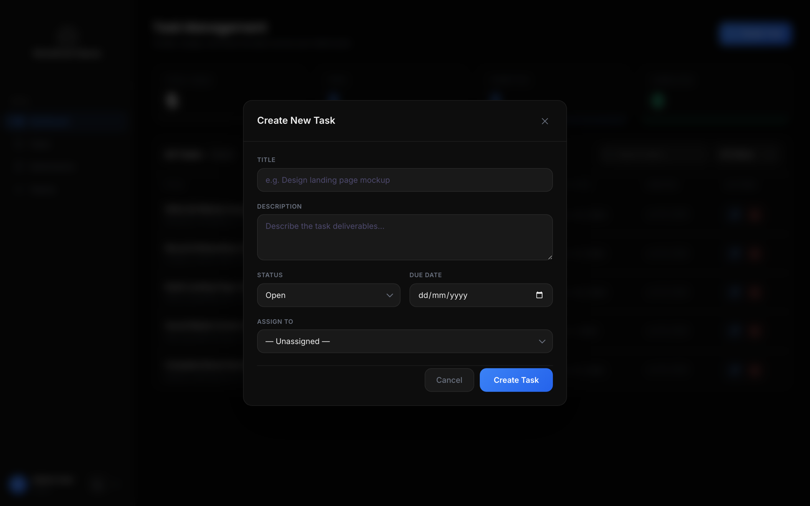
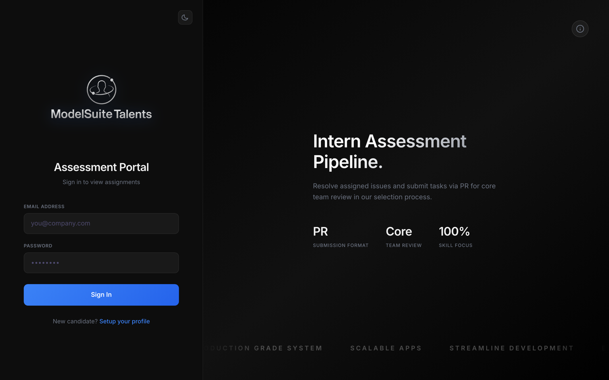
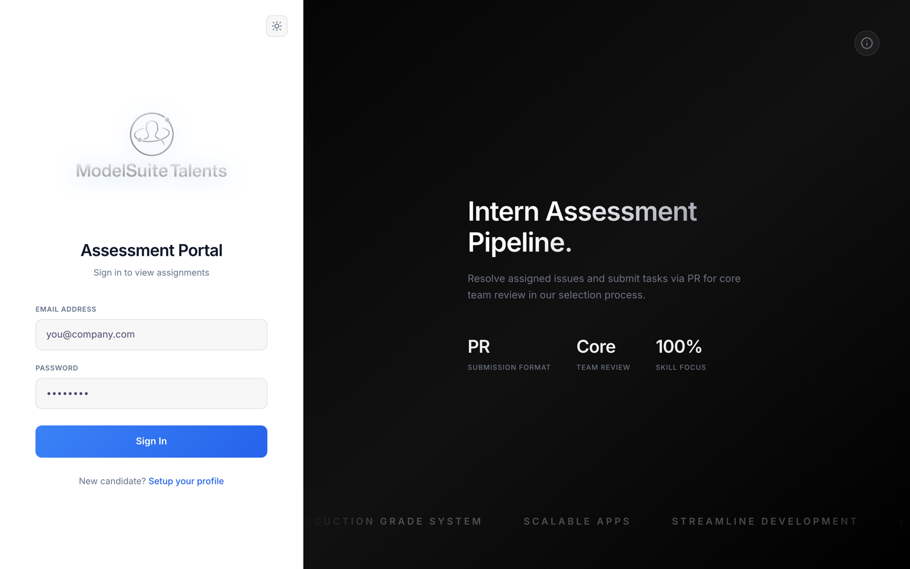
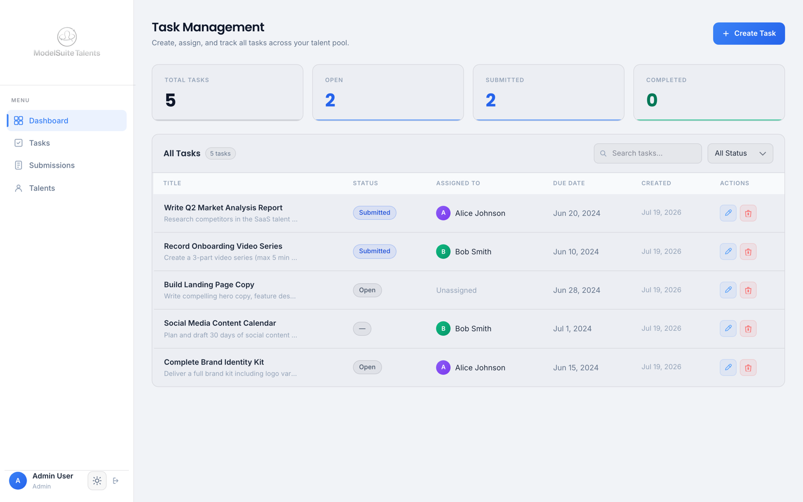
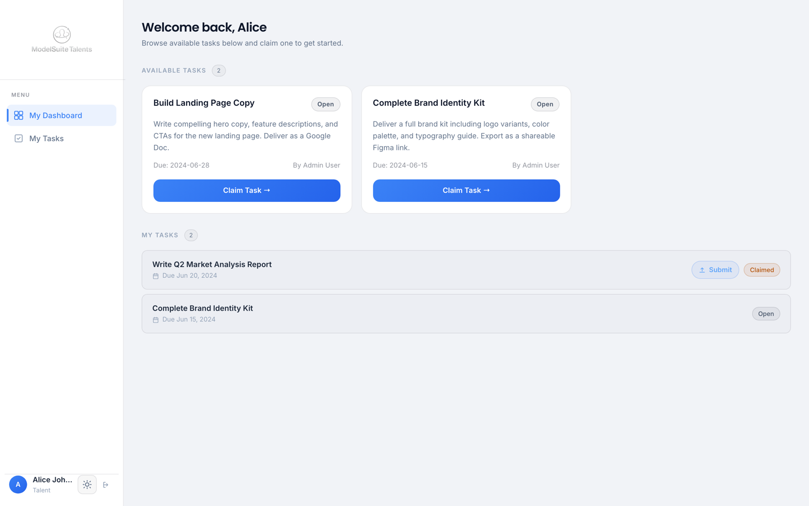

# Solution Notes — Qualification Submission

Branch: `169-21-16-8-2-1-garv-bahl` · Author: garvbahl37-gif

This document explains, per issue, what the bug/requirement was, its root cause,
the fix that was applied, the files touched, and how it was verified. All six
assigned tasks are implemented in a single pull request.

| # | Type | Title | Area |
|---|------|-------|------|
| 2 | Bug | Task assignment allows Admin-to-Admin assignment | Backend |
| 8 | Bug | Approving submissions fails to cascade status to parent task | Backend |
| 1 | Bug | Successive task submissions overwrite previous data | Backend |
| 21 | Feature | Support multiple files per submission | Backend + Frontend |
| 16 | UX | Missing loading indicators on critical actions | Frontend |
| 169 | UI | Premium dark/light theme system | Frontend |

A required enabling fix (ESLint configuration) and a new backend test suite are
documented at the end. Screenshots below each section show the result in the
running app (light and dark themes).

---

## #2 — Task assignment allows Admin-to-Admin assignment

**Problem.** The task API accepted any user id in `assignedTo`, including users
with the `Admin` role, breaking the Talent/Admin separation.

**Root cause.** `createTask` and `updateTask` wrote `assignedTo` straight to the
document with no validation of the target user's role.

**Fix.** Added a `validateAssignee` helper in
`server/controllers/taskController.js`. Before creating or updating a task it
looks the assignee up and rejects the request with `400` when the user does not
exist or is not a `Talent`. Unassigned tasks (`assignedTo` empty/null) remain
valid. The check runs on both create and update (update only when the request
actually touches `assignedTo`).

- `server/controllers/taskController.js`

**Verified.** Tests assert: assigning to an Admin returns `400` on create and on
update; assigning to a Talent returns `201`; an unassigned task is allowed; a
non-existent assignee returns `400`.

---

## #8 — Approving submissions fails to cascade status to parent task

**Problem.** Approving a submission left the parent task stuck in `Submitted`
forever; it never moved to a completed state.

**Root cause.** `reviewSubmission` updated only `submission.reviewStatus` and
never touched the parent `Task`. It also accepted any arbitrary string as a
review status.

**Fix.**
- `reviewSubmission` now validates `reviewStatus` (only `Approved` / `Rejected`;
  anything else is `400`).
- On success it cascades to the parent task: **Approved -> task `Completed`**,
  **Rejected -> task `Rejected`**.
- `Completed` was added to the `Task` status enum and surfaced across the UI:
  a new status badge style, the admin status filter, and the dashboard stat card
  (the fourth card now counts `Completed` tasks).

Files: `server/controllers/submissionController.js`, `server/models/Task.js`,
and (UI) `client/src/index.css`, `client/src/pages/admin/AdminDashboard.jsx`,
plus the status-badge maps in the task list components.

**Verified.** Tests assert Approved -> `Completed`, Rejected -> `Rejected`, and
that an invalid status returns `400`. The end-to-end screenshots show a task
flipping to the green `Completed` badge and the Completed stat incrementing right
after Approve.

After approving a submission, the parent task shows the green **Completed** badge
and the Completed stat card increments (Submitted decrements):



---

## #1 — Successive task submissions overwrite previous data

**Problem.** When a Talent submitted the same task more than once, the previous
submission (and its file) was overwritten and lost with no warning.

**Root cause.** `submitTask` did `findOne({ taskId, talentId })` and, if a record
existed, mutated it in place — destroying the prior attempt.

**Fix.** Submissions are now append-only. Every submission creates a **new**
`Submission` document, so no attempt is ever lost. A 1-based `attempt` field
records the order of each attempt for the task/talent pair (computed from the
count of prior submissions). The admin review modal displays the attempt number,
and the existing "all submissions" queue naturally shows the full history.

Files: `server/controllers/submissionController.js`, `server/models/Submission.js`
(`attempt` field), and (UI) `client/src/components/admin/SubmissionReviewModal.jsx`.

**Verified.** A test submits twice and asserts two distinct documents exist with
`attempt` 1 and 2 and the original notes preserved on each.

The admin review modal surfaces the attempt number for each submission:



---

## #21 — Support multiple files per submission

**Problem.** A submission could carry only a single file.

**Fix (backend).**
- `Submission` gained `fileUrls: [String]`. The legacy `fileUrl` is kept as a
  mirror of the first file so any older reader keeps working.
- The upload route uses `upload.array('files', 10)`; the Multer middleware sets a
  per-file size limit (25 MB) and a max file count.
- `submitTask` builds `fileUrls` from `req.files`, and builds each URL from the
  incoming request host (instead of a hard-coded `localhost:5000`) so links keep
  working regardless of where the API is served.

**Fix (frontend).**
- `SubmitTaskModal` accepts multiple files with an add/remove list and a size
  readout, de-duplicates by name+size, and enforces the 10-file cap.
- The admin review modal and the submissions table list **every** file, with a
  backward-compatible fallback to the legacy single `fileUrl`.

Files: `server/models/Submission.js`, `server/middleware/upload.js`,
`server/routes/submissionRoutes.js`, `server/controllers/submissionController.js`,
`client/src/components/talent/SubmitTaskModal.jsx`,
`client/src/components/admin/SubmissionReviewModal.jsx`,
`client/src/pages/admin/SubmissionsPage.jsx`.

**Verified.** A test uploads two files and asserts `fileUrls.length === 2` and
that `fileUrl` mirrors the first entry. Screenshots show the multi-file picker
and the review modal listing both files.

Multi-file picker with per-file remove and size (light and dark):

| Dark | Light |
|------|-------|
|  |  |

The admin submissions table lists every file per submission:



---

## #16 — Missing loading indicators on critical actions

**Problem.** Forms and critical actions gave no visual pending feedback; buttons
stayed active during the request, allowing accidental double-submits.

**Fix.** Added a shared `Spinner` component and a pending state to every critical
async action. While a request is in flight the button is disabled and shows a
spinner with an in-progress label:

- Login, Register
- Submit Task
- Claim Task
- Approve / Reject (each button locks independently)
- Create Task, Edit Task
- Delete Task (per-row spinner)

Files: `client/src/components/Spinner.jsx` (new), `client/src/pages/LoginPage.jsx`,
`client/src/pages/RegisterPage.jsx`,
`client/src/components/talent/SubmitTaskModal.jsx`,
`client/src/components/talent/TaskCard.jsx`,
`client/src/components/admin/SubmissionReviewModal.jsx`,
`client/src/components/admin/CreateTaskModal.jsx`,
`client/src/components/admin/EditTaskModal.jsx`,
`client/src/components/admin/TasksTable.jsx`.

**Verified.** Screenshots and the local end-to-end run show the disabled/spinner
state during submit and approve. Every create/edit/submit/review action button
disables and shows a spinner while its request is in flight, for example the
Create Task form:



---

## #169 — Premium dark/light theme system

**Problem.** The app shipped a single hard-coded dark theme; the issue asks for a
polished, switchable theme with an animated toggle.

**Fix.** Introduced a runtime CSS-variable theme layer:

- Semantic tokens are defined on `:root` (dark, default) and overridden under
  `:root[data-theme="light"]`. Tailwind's `@theme inline` maps every colour
  utility (`bg-bg-card`, `text-text-primary`, `border-border`, ...) to those
  variables, so flipping `data-theme` re-themes the entire app with no
  per-component churn.
- `ThemeContext` persists the choice to `localStorage`, honours the OS
  `prefers-color-scheme` on first visit, and a small inline script in
  `index.html` applies the theme before first paint (no flash).
- An **animated sun/moon toggle** (`ThemeToggle`) sits in both sidebars and on
  the auth screens; the two icons rotate/cross-fade between states.
- Remaining hard-coded inline colours were converted to theme tokens. The
  marketing panel on the auth screens is intentionally kept dark in both themes
  via a scoped `.theme-dark-scope` class.
- Both themes were contrast-checked for WCAG AA (badge text colours are darkened
  on light surfaces).
- `prefers-reduced-motion` is respected for the animations.

Files: `client/src/index.css`, `client/index.html`, `client/src/main.jsx`,
`client/src/context/ThemeContext.jsx` (new),
`client/src/components/ThemeToggle.jsx` (new), and colour conversions across the
sidebars, dashboards, tables, and list components.

**Verified.** Screenshots of every page and modal in both light and dark; the
theme persists across reloads and route changes.

Login screen — the sun/moon toggle switches the whole app (the marketing panel
stays dark by design):

| Dark | Light |
|------|-------|
|  |  |

The dashboards fully re-theme (admin, light shown; talent, light shown):

| Admin (light) | Talent (light) |
|------|-------|
|  |  |

---

## Enabling fix — ESLint configuration (required for green CI)

The client `eslint.config.js` never registered `eslint-plugin-react` even though
it was already a devDependency. Without it, `no-unused-vars` did not recognise
JSX element usage, so **every** imported component was reported as "unused" and
`eslint .` failed on untouched code (40 errors). CI runs `eslint .` project-wide,
so this had to be fixed for any client change to pass.

- Registered the plugin and enabled `react/jsx-uses-vars` + `react/jsx-uses-react`
  (a minimal, targeted change — the full recommended config would have added
  unrelated `prop-types` noise).
- Added a single, standard scoped disable for `react-refresh/only-export-components`
  on the Context files (a co-located provider + hook is a normal React pattern).
- Fixed one unused catch binding in `server/middleware/authMiddleware.js`.

Both projects now lint clean with `--max-warnings 0`.

---

## Tests

A new backend integration suite exercises the real Express routes end-to-end
using Node's built-in test runner and `supertest`, backed by an in-memory
MongoDB (`mongodb-memory-server`) — no external database or running server
required.

```bash
cd server && npm install && npm test
```

Coverage (10 tests, all passing): #2 (admin assignment rejected on create and
update, non-existent assignee, Talent allowed, unassigned allowed), #8
(Approved -> Completed, Rejected -> Rejected, invalid status -> 400), #1 (history
preserved across two submissions), #21 (multiple files stored in `fileUrls`).

To make the app testable, `server/index.js` now exports the configured Express
app and only connects to the database / starts listening when run directly
(`require.main === module`), so the suite can drive the app against its own
database. `npm start`, `npm run dev`, and `node -c index.js` are unaffected.

---

## How to run and verify locally

```bash
# Backend
cd server
npm install
npm run lint      # clean, --max-warnings 0
npm test          # 10 passing integration tests
npm run seed      # optional demo data (needs a MongoDB at MONGO_URI)
npm run dev       # start API

# Frontend
cd client
npm install
npm run lint      # clean, --max-warnings 0
npm run build     # succeeds
npm run dev       # start UI
```
